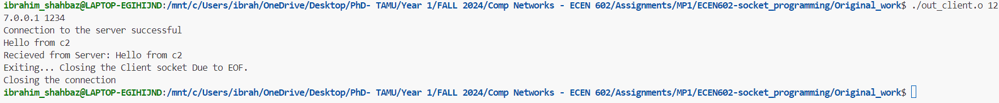
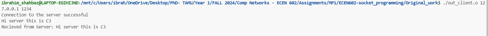

# Team 8: ECEN602-socket_programming
ECEN 602 Machine Problem-1 by Team 8

## Socket programming introduction and architecture

In this project, we have implemented a client server TCP socket where multiple clients can echo to the server.

### Functions used in the Server side
#### 1. Socket():
 A socket descriptor is defined containing the socket family(whether IPv4 or IPv6) and socket type(TCP or UDP). In our case we have implemented a TCP socket stream and IPv4 address scheme.

#### 2. bind():
Binds the socket to the specified IP address and port number to listen

#### 3. listen():
Listens for clients at the specified IP address and port.

#### 4. accept():
The server waits for client connection to complete

#### 5. read():
This function reads a line of text from the client and stores them in a buffer with a specified size. read() is also used to get the TCP_FIN packet from the client.

#### 6. send():
This function writes data buffer from the client to the server. 

#### 7. close():
Closes the client/server instance. When the client closes the connection, the TCP_FIN packet is received by the server.

## Steps to run the code
1. make all
2. make echos PORT="PORT NUMBER"
3. make echo IP="IP ADDRESS" PORT="PORT NUMBER" in another terminal

## Contribution

## Test Case Execution

1. Line of text executed by newline

In this test case, once the client has established connection with the server, the client sends a single line of text, For e.g. "This is team 8" and the message is checked on the server.

Server side

Client side

2. line of text the maximum line length without a newline

3. line with no characters and EOF

Server side

Client side

4. client terminated after entering text

Server side

Client side

5. three clients connected to the server.

Server side

Client side

