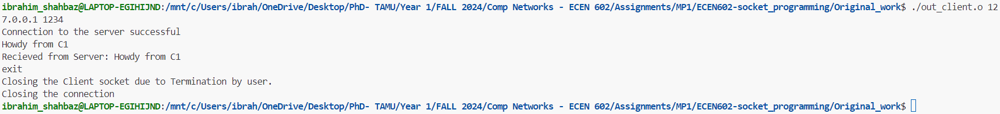

# Team 8: ECEN602-socket_programming
ECEN 602 Machine Problem-1 by Team 8


## Socket programming introduction and architecture


In this project, we have implemented a client server TCP socket where multiple clients can echo to the server.


### Functions used by both client and server
#### 1. Socket(): A socket descriptor is defined containing the socket family(whether IPv4 or IPv6) and socket type(TCP or UDP). In our case we have implemented a TCP stream socket and IPv4 address scheme.

#### 2. read(): This function reads a line of text from the client and stores them in a buffer with a specified size. read() is also used to get the TCP_FIN packet from the client.

#### 3. send(): This function writes data buffer from the client to the server. 

#### 4. close(): Closes the client/server instance. When the client closes the connection, the TCP_FIN packet is received by the server.

### Functions used by the server
#### 1. bind(): Binds the socket to the specified IP address and port number to listen

#### 2. listen(): Listens for clients at the specified IP address and port. It is used to accept incoming clients

#### 3. accept(): The server waits for client connection to complete. This function also hold the clients information(e.g. address).

#### Functions used by the client

#### 1. connect(): Initiates a connection to the socket at the specified IP address and port number.

## Steps to run the code

Main code is present in "/Original_work" directory which contains the original code. below are the commands to run the makefile.
```console
cd Original_work/
```
```
make all
```
```
make echos PORT="PORT NUMBER"
```
Open another terminal and enter the following
```
make echo SERVER_ADDR="IP ADDRESS" PORT="PORT NUMBER" 
```

### Example 
```console
make echos PORT=1234
make echo SERVER_ADDR=127.0.0.1 PORT=1234
```

## Test Case Execution

1. Line of text executed by newline
 
In this test case, once the client has established connection with the server, the client sends a single line of text, For e.g. "This is team 8" and the message is checked on the server.
 
Server side

 
Client side

 
2. line of text the maximum line length without a newline
In this test case we build two scenarios. In the first scenario(2.1), the buffer size is limited to 5 on the client size and we send a message of size 15 from client too server. While in the second scenario (2.2), we limit the buffer size on the server side to 5, and we send a message of size 15 from client to server.
 
Server side terminal for 2.1

 
Client side terminal for 2.1

 
Server side terminal for 2.2

 
Client side terminal for 2.2

 
3. line with no characters and EOF
 
Server side

 
Client side

 
4. client terminated after entering text
 
Server side terminal

 
Client side terminal

 
5. Three clients connected to the server.
In the last test case, we test our server for handling requests from 3 different clients at a time. The server is able to diffrentiate which client is sending the echo request.
 
Server side terminal

 
Client side terminals



## Contributors

### Shubham Santosh Kumar(UIN: 835008989)
1. Developed server code.
2. Added capabilitied to handle multiple clients.
3. Contributed to documentation of code.

### Ibrahim Shahbaz(UIN: 236001615)
1. Developed Client code and documented it.
2. Worked on handling test cases.